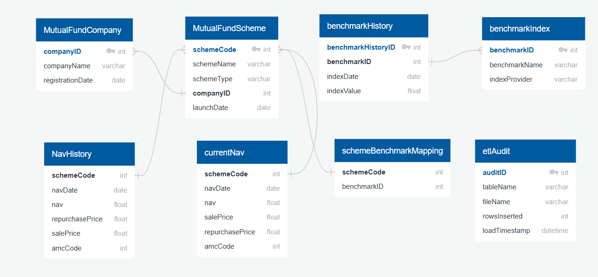

# Mutual Fund Analytics Pipeline (ETL)

An end-to-end data engineering pipeline that automates the **extraction, transformation, and loading (ETL)** of mutual fund NAV data into a **Snowflake data warehouse**, along with benchmark indices (NIFTY 50, BSE Sensex).  

The pipeline enables **real-time comparison of mutual funds against their benchmarks** with full historical tracking, inspired by Moneycontrol-style dashboards.

---

## 📌 Project Overview
This project provides:
- Automated daily ingestion of **mutual fund NAVs** from AMFI India.  
- Integration of **benchmark index data** (NIFTY 50, BSE Sensex).  
- Storage and historical tracking in **Snowflake**.  
- Daily **ETL orchestration using Apache Airflow**.  
- Real-time analytics for **fund vs. benchmark performance comparisons**.  

---

## ⚙️ Architecture
1. **Data Extraction**
   - Scrapes daily NAV data directly from [AMFI India](https://www.amfiindia.com).
   - Fetches benchmark index values via external APIs.

2. **Data Storage (Snowflake)**
   - `current_nav` → Latest NAV values.  
   - `nav_history` → Historical NAV tracking.  
   - `mutual_fund_company` & `mutual_fund_scheme` → Fund houses and schemes.  
   - `benchmark_index` & `benchmark_history` → Benchmarks and historical values.  
   - `scheme_benchmark_mapping` → Links schemes to benchmarks.  
   - `etl_audit` → Logs ETL run metadata.
### Logical Schema

  

### Conceptual Schema

  

3. **ETL Orchestration (Apache Airflow)**
   - DAG scheduled to run daily at **6:00 AM IST**.  
   - Steps:  
     - Extract NAV data → Load into `current_nav` → Update `nav_history`.  
     - Fetch & update benchmark data.  
     - Run fund vs. benchmark comparison queries.  
     - Log ETL metadata into `etl_audit`.  

4. **Analytics**
   - Compare **mutual fund NAVs vs. benchmark returns** in real time.  
   - Track **historical performance** trends.  
   - Enable dashboards for visualization and insights.  

- `mutual_fund_company` & `mutual_fund_scheme` → Fund houses and their schemes  
- `benchmark_index` & `benchmark_history` → Index values and their history  
- `scheme_benchmark_mapping` → Links schemes to benchmarks  
- `etl_audit` → Logs ETL metadata  

![Database Schema Diagram]
